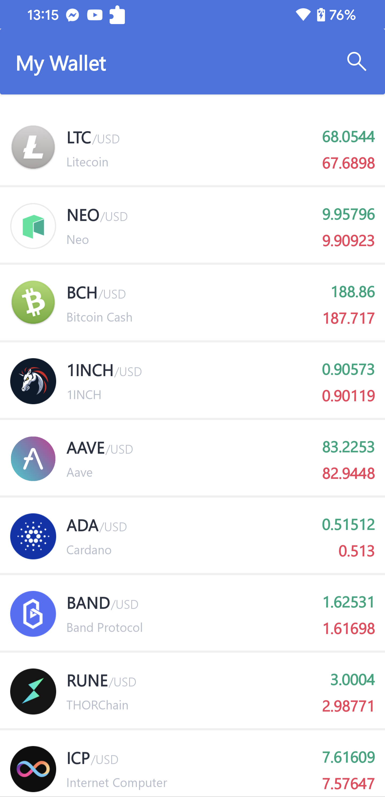

# CH_WALLET

- Ch Wallet is a virtual currency wallet simulation application.

- Architecture : MVVM

- Tech: Navigation Graph, Koin, data binding, Coroutines, Retrofit, Glide, Live data, DES, Share Preference.

- Library and version:
  - androidx.core: '1.7.0'
  - material: '1.6.0'
  - navigation-graph: '2.3.0-alpha01'
  - Gson: '2.9.0'
  - Glide:'4.13.0'
  - Preferences: '0.1.3'
  - Coroutines: '1.4.1'
  - Kotlin: '1.6.7'
  - Koin: '3.2.0'
  
- Image demo app:
- 
  

  

